\newpage

# Introduction

This document exists to document design decisions, as well as give information
about the hardware involved. It also allows for us to predict potential issues
and already have solutions for those.

\newpage

# Diagram

Figure 1 shows a basic block diagram of how the electronics will be connected,
mostly concerning itself with supplying the correct voltage to each location.
The top number is simply an ID of the block, the second name is a generic name
and below that is either `Out`, the output voltage or `In`, the input voltage.

\newpage

# Breakdown

The following component breakdown is to allow for considerations to be made
early on with regards to what will be the required voltage in order to get the
electronics operating correctly. This allows us to make an efficient PSU (power
supply unit) and consider which part will be responsible for supplying power.

\newpage

## `[01]` Battery

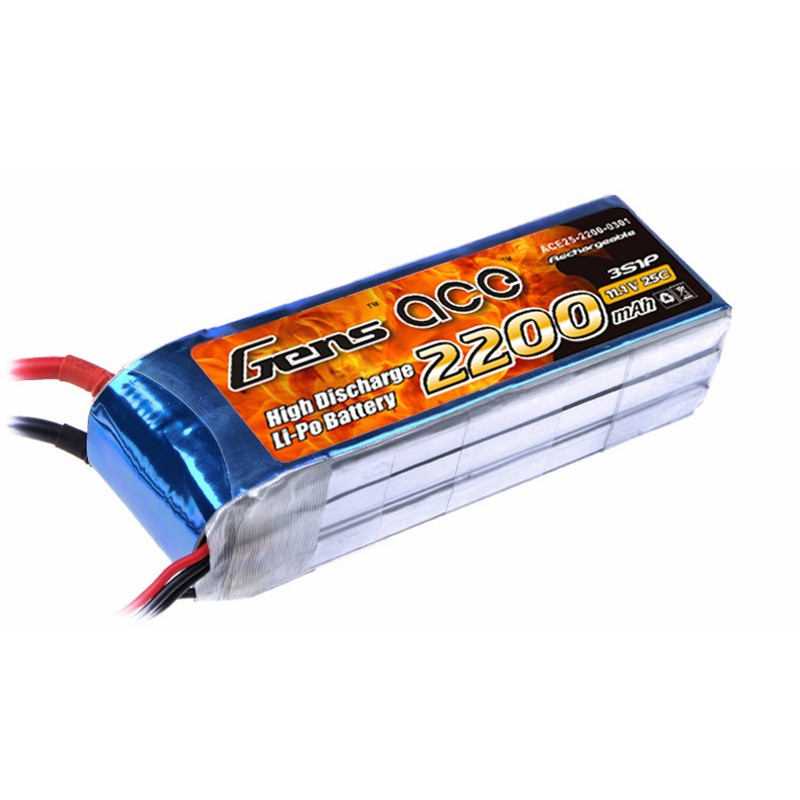

### Requirements

* `>2000mAh` -- The robot needs to last for 10 minutes (one half of a game).
  The battery capacity must be higher that is required within that time, as the
  robots can sit a while whilst waiting for game start and power output over
  the play time is not linear. The battery's capacity will also drop over time
  due to use, possibly as low as 50%.
* `Common connector` -- Allow us to use batteries of several different types
  and find common parts.
* `Balanced charger` -- Cells must be charged and kept at the same voltage
  (with small tolerance). Largely unbalanced cells can lead to thermal runaway
  events.

### Description

**NOTE:** There is no description until the hardware is decided.

### Risks and Solutions

* *Battery damage* -- Batteries can become damage beyond repair.
  *Solution:* Battery can be discharged to `0V` and put in normal household
  rubbish without special treatment. An additional step is to twist the main
  terminals together as proof of its discharged state.
* *Battery explosion* -- Batteries can explode and catch fire.
  *Solution:* Whilst in use (charge or discharge), keep in a LiPo safe
  container/bag.
* *Cells unbalanced* -- This is where the battery voltages of each cell becomes
  different. This can cause current loops within the battery, leading to
  thermal runaway events.
  *Solution:* A balanced charger can be used to charge each cell individually.
* *Cells depeleted* -- Cells that drop down to 0V are to be considered dead, as
  this represents a large amount of damage to the battery's chemistry.
  *Solution:* Replace the battery, see "Battery damage".
* *Battery too warm* -- Batteries operating at temperatures too hot to touch.
  *Solution:* See "Battery damage". If this is considered too risky, battery
  should be dropped in a high salt solution bucket of water and left for
  several weeks in a safe place.
* *Battery bloated* -- If excessive, it can be gas trying to escape from the
  LiPo.
  *Solution:* See "Battery damage".
* *Storing batteries* -- Storing batteries for a long time can cause issues
  with the battery chemistry for later use.
  *Solution:* Discharge/charge the batteries to nominal storage voltages.

\newpage

## `[02]` Direct Current

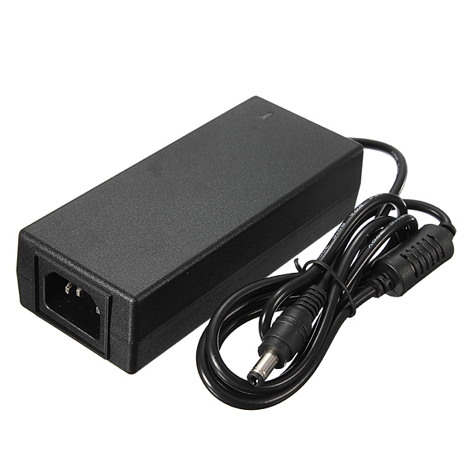

### Requirements

* `>5A` -- Power required to run the robot safely in mostly stand-by mode.
* `>2m` -- Length of the power cord to allow movement of the robot without
  pulling on the power socket.
* `Ground` -- The power cord should have a ground pin to prevent static build
  up. This can happen on metal parts and be dangerous the ESD (Electro Static
  Discharge) sensitive parts.

### Description

**NOTE:** There is no description until the hardware is decided.

### Risks and Solutions

* *Intermitten supply* -- When cables or connectors are starting to break, the
  output can be non-steady and create noise. This in general is not too much
  human risk, but may cause issue when changing batteries during competition as
  the robots could temporarily be without power, causing a reboot and possible
  corruption.
  *Solution:* Test the supplies and mark them as "bad" if found to be non-working.
* *Varying mains voltage* -- Travelling to different competition locations may
  mean that the input voltage varies from 240V down to 100V.
  *Solution:* Purchase units that are able to deal with the change in supplies.
* *Broken cable* -- On mains side, this is exceptionally dangerous, although
  with alternating current. DC side, the voltage is low and human body
  resistance is high, so the electric shock should be minimized.
  *Solution:* Any cables identified as bad should be purposely cut in half in
  order to prevent future use.

\newpage

## `[03]` Power Supply Unit

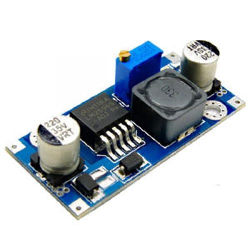

### Requirements

* `10-20A` -- The power supply must be able to support at least 10A of constant
  current and an estimated 20A of peak current in order to keep up with the
  potential motor loads.
* `Testable` -- The power supply must be testable in order to ensure it is
  working correctly.
* `Replaceable` -- It is likely that the design will eventually break, it
  should be a design we are able to rebuild with relative ease.
* `Upgradeable` -- In the future we may need to be able to upgrade our power
  consumption as the size of our robot tends towards human. The design should
  be such that we can simply replace components with larger capacity ones and
  still be able to use the same design.
* `Constant voltage` -- The PSU must provide reliable voltage regardless of the
  DC or battery value (within reason).
* `DC-Battery switch` -- The system must automatically switch between DC power
  and battery power, with preference on battery power.
* `Power indicator` -- There must be a low power indicator for which supply is
  currently in use.
* `Low power warning` -- The system must provide warning of low power in
  audible form that can be heard from a reasonable distance.
* `Low power cutoff` -- When the battery is below a selected voltage, the power
  supply must switch off all non-essential supplies in order to prevent battery
  damage.
* `Power switch` -- We must be able to switch the power off reliably.

### Description

The result of a team discussion on the matter has lead us to strive towards
using a mostly off-the-shelf components in order to speed up the design
process. As a result the following diagram has been proposed:

The following is a breakdown of parts:

* `[A]` (*DC Source*) -- This is the mains supply to 12V DC power converter.
* `[B]` (*Batt Source*) -- This is a three cell LiPo.
* `[C]` (*Darwin PSU*) -- This is a simple design borrowed from the Darwin OP
platform.
* `[D]` (*Buck StepDown*) -- This is for the PWM motors.
* `[E]` (*Buck StepDown*) -- This is for the smart motors.
* `[F]` (*USB PWM PSU*) -- This is for the main board.
* `[G]` (*PSU Controller*) -- This is for low battery control.

Proposed components:

* `[C]` -- Darwin OP PSU:
https://sourceforge.net/projects/darwinop/files/Hardware/Electronics/Boards/DARwIn-OP_Power.pdf/download
* `[D]`, `[E]` -- Step down buck converter:
https://www.banggood.com/3Pcs-XL4015-5A-DC-DC-Step-Down-Adjustable-Power-Supply-Module-Buck-Converter-p-1157548.html
* `[F]` -- USB power supply:
https://www.banggood.com/XH-M249-DC5V-6A-Step-Down-Module-12V24V-to-5V-Power-Supply-USB-Charging-5A-30W-p-1264861.html
* `[G]` -- Digispark:
https://www.banggood.com/Digispark-Kickstarter-Micro-USB-Development-Board-For-ATTINY85-Arduino-p-1038088.html

### Risks and Solutions

* *Power sinking* -- The battery and DC inputs should be completely isolated
  from one another. If not, there is potential for either one to be damaged.
  *Solution:* The electronics should be designed in such a way that it is
  impossible for both to be in at the same time.
* *Computer crash* -- The onboard may be in the middle of doing a write to
  disk whilst experiencing sudden loss of power, therefore opening up the
  potential to corruption.
  *Solution:* The main disk should be removable and replaceable relatively
  easily, as well as the power control offering a signal for the main board to
  shutdown safely.
* *Low battery* -- A battery that is used for a length of time may run low.
  *Solution:* Alarm for low power scenarios, followed by manual shut-off.
* *Electrostatic discharge* -- The power supply may have a DC offset either due
  to a badly earthed mains or simply from movement of the robot and rubbing of
  materials.
  *Solution:* Isolation from human interference, meaning no conductive parts
  should be touchable.
* *Heat* -- The system will likely provide a lot of heat at full power.
  *Solution:* Active calling may be required on order to prevent damage to the
  chassis.

\newpage

## `[04]` Smart Controller

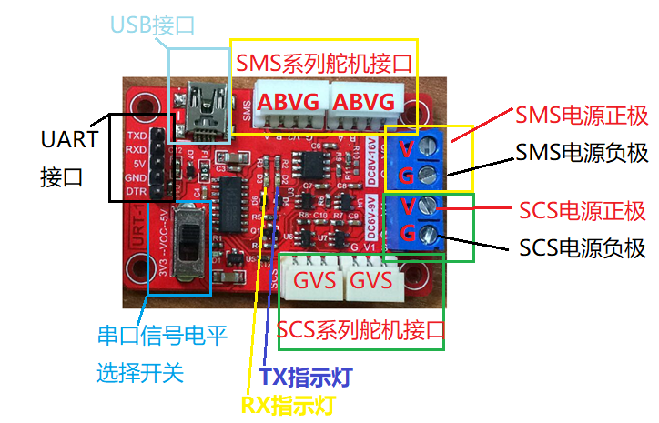

### Requirements

* `Smart motor communication` -- The smart motor controller must be able to
  able to communicate with multiple smart motors.
* `Main board communication` -- The smart motor controller must be able to
  communicate with the main board, ideally via USB.
* `Position control` -- The controller must be able to update specific motor
  positions, as well as retrieve data about individual motors.

### Description

Source: https://www.alibaba.com/product-detail/Multi-function-serial-port-signal-converter_60707270225.html?spm=a2700.7724838.2017121.17.4e7bb5fbbG1VDk

#### Quick Details

    Place of Origin: Guangdong, China (Mainland)
    Model Number:    FE-URT-1
    Type:            USB/URAT to SMS (RS485) &S...
    Quality:         Magnetic coding servo
    Color:           Red
    SHIPPING WAY:    DHL FEDEX UPS EMS TNT
    Payment term:    Paypal TT WU ESCROW
    Brand Name:      FEETECH
    Product Name:    Multi function serial port signal...
    Application:     Serial control servo
    Package:         Standard Package (plastic Bag...
    Material:        ABS
    Condition:       Brand Newand Original

#### Package & Delivery

    Packaging Details: packed with PE bag then carton box
    Delivery Time:     3 working day

#### Product Description

**Multi function serial port signal converter USB/URAT to SMS (RS485) &SCS
(TTL)**

**Overview of 1. functions**

URT-1 multifunction serial signal converter, in order to facilitate the user to
debug and use SMS and SCS composite Feite series serial servo design.

URT-1 integrated USB serial port chip, combined with linear low-voltage
differential voltage regulator circuit, USB signal can be easily converted to
5V or 3V3 serial signal level.

In the URT-1 board, serial signal conversion circuit respectively into two
different levels of signal, which A road - asynchronous half duplex RS485 level
port can be connected to the SMS series servo; B - asynchronous half duplex TTL
level single bus port can be connected to the SCS series of steering gear.

In the URT-1 board in the input and output signal by using asynchronous serial
time-sharing using hardware circuit, hardware automatic diversion, without the
use of additional IO enable to control, reduce the occupation of MCU port
burden and code simple.

USB port using USB MINI interface; UART interface with 2.54 row spacing
general; SMS series servo interface using 5264-4AW interface can be directly
connected to the steering gear; SCS series servo interface using 5264-3AW
interface can be directly connected to the steering gear.

The working voltage of SMS and SCS series servo fit is not the same, reuse
requires a different working voltage, power supply port and can also access the
SCS from the SMS section of the step-down power supply high voltage after
making the system with a power supply to provide power.

Because the power port has overcurrent limit, the maximum is 6A, so it is
necessary to do additional power distribution processing in the actual
application of the serial connection of more servos. URT-1 is only used for
signal conversion.

**2. functional features**

Full speed USB device interface, compatible with USB V2.0

Support baud rate 50bps~1Mbps

5V and 3V3 UART serial port signal level can be switched freely

Supports 32/64 bit Windows 10/8.1/8/7/VISTA/XP, SERVER
2016/2012/2008/20032000/ME/98

Microsoft digital signature authentication

SMS and SCS series servos can be shared by one serial port for control

The serial port signal is asynchronous half duplex communication mode, and the
hardware automatic diversion needs no additional enable IO

The interface of servo system adopts error proofing connection to ensure proper
connection

UART interface is general pin way, can be used as USB to serial port output,
also can connect MCU UART to control the steering gear

With signal level power indicator (D1), TX (D2) and RX (D3) indicator,
convenient to view data status

The 5V voltage is supplied from the USB, otherwise the external voltage is
supplied to the 5V

500mA overcurrent protection and overvoltage protection for USB power supply
belt

**3. specification parameters**

Weight: 12.5 grams

Size (L*W*H):55.8 * 36.6 * 11.5 mm

Mounting size: 48.8 * 28.8 mm

USB interface: MINI USB

UART interface: 2.54 pin spacing

SCS servo interface: 3PIN 5264-3AW

SMS servo interface: 4PIN 5264-4AW

Actuator power interface: 5.08 terminal

**4.motherboard port:**

**5. need matching list**

MINI USB connection line

Power supply and line of rudder

Connecting line between steering gear and steering engine

Du Bangxian (optional)

**6. drive installation**

CH340C driver download address:

Http://www.wch.cn/download/CH341SER_EXE.html

Run the installer driver after download

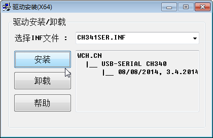

Click Install to wait for a period of time, do not close the installer before
prompt for successful installation.

Successfully installed or installed successfully before the driver, in the
URT-1 connection to the computer USB port, in the computer device manager can
see the corresponding port number.

**7. hardware connection**

Access the corresponding servos to the corresponding servos interface

The correct power supply is connected to the servo power supply port, in
particular, the positive and negative pole of the power supply can not be
connected

Connecting URT-1 and PC with MINI USB line

The following is a physical connection between the SMS series and the SCS
series servos, as shown below:

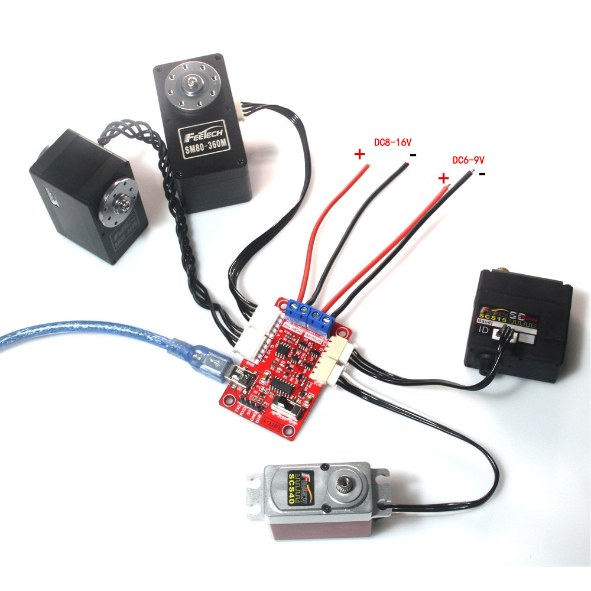

**8. software testing**

Test with FD software

Debugging assistant test with serial port

### Risks and Solutions

* *Current limit hit* -- The smart motor controller has a current limit of
  `6A`.
  *Solution:* Potentially we may have to bypass the voltage supply provided by
  the board. This will require reverse engineering the power limiting circuit.

\newpage

## `[05]` PWM Controller

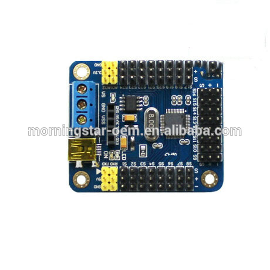

### Requirements

* `PWM motor communication` -- The controller must be able to communicate with
  the motors via an acceptably clean pulse width modulation input signal.
* `Main board communication` -- The controller must be able to communicate with
  the main board via USB.
* `Input voltage tollerance` -- The controller must be able to support a wide
  range of input voltages to give us flexibility.
* `Output voltage tollerance` -- A wide range of output voltages is required to
  support the two types of PWM motors that we plan to drive.
* `Individual motor control` -- We must be able to control each PWM motor
  individually.

### Description

Source: https://www.alibaba.com/product-detail/UNO-mini-USB-24-servo-control_60702742954.html?spm=a2700.7724838.2017115.419.2c57d290Fccxzl

#### Quick Details

    Place of Origin:     Guangdong, China (Mainland)
    Model Number:        MS013
    PCB size:            51mm*43.5mm*1.6mm(Mount...
    Payment:             Paypal or T/T or Western Union
    Brand Name:          MS
    Signal output:       PWM (accuracy 1us)
    Server motor dri...: 1us, 0.09 degrees

#### Package & Delivery

    Packaging Details: standard
    Delivery Time:     1 day

#### Product Description

UNO mini USB 24 servo control board Controller Servo Motor USC-24 (Line Feed)

**PRODUCT FEATURES**

1. Control chip power supply range: 6.5V ~ 12V or 4.5V ~ 5.5V. (Why there are
two ranges? Because there are two inputs) (USB can give the servo control board
chip power supply, automatic selection, with USB reverse protection, you can
protect your computer is not reverse USB voltage burned)

2. Servo part of the power supply range: DC DC (voltage and steering gear
parameters, the general use of 5V DC).

3. Control channel: control 16 at the same time. (Steering gear speed is
adjustable, the robot moves smooth and comfortable)

4. Communication input: USB or serial port (TTL, USART). (Wireless control of
the steering controller can be done using a wireless Bluetooth module or other
wireless module)

5. Signal output: PWM (accuracy 1us).

6. Servo motor drive resolution: 1us, 0.09 degrees.

7. Baud rate range: 9600 19200 38400 57600 115200 128000. (Fully automatic
identification, no need to set)

8. Support the servo motor: Futaba or Hitec and domestic brands such as
Huisheng, etc., spike all use PWM signal control of the steering gear.

9. PCB size: 51mm x 43.5mm x 1.6mm (mounting hole spacing: 42 * 35.5mm).

10. Control mode: USB and serial (TTL) to accept the command mode. (With USB
data cable and host computer control software, software can be upgraded at any
time)

11. flash: Onboard 512K ROM. (If each command is to control the 32 steering gear
at the same time, you can save more than 500 instructions, if the order is very
short, save thousands of questions is not a problem)

**PRODUCT PICTURES**

### Risks and Solutions

* *High current* -- It's possible that if we draw too high a current that we
  burn out the PCB traces.
  *Solution:* Prevent prolonged high current draw situations. This could be
  monitored for in the PSU controller, as high current draws will likely drop
  the supply voltage.
* *Update rate* -- Motors may be updated too slowly, causing jitter (which can
  be dangerous).
  *Solution:* Prioritize motor updates if required in order to guarantee a
  minimum refresh rate for important/potentially dangerous motors.
* *Update corruption* -- Changing from one motor position to another may cause
  the PWM signal to be corrupted, which could be dangerous for a 30kg/cm motor
  to suddenly jump to a random position.
  *Solution:* The selected motor position shouldn't be changed too drastically
  in the code, we should plot positions over time to prevent sudden jumps.

\newpage

## `[06]` Main Board

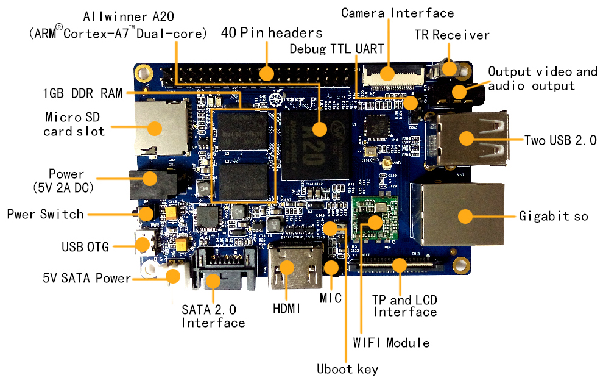

### Requirements

* `CPU` -- We will need a multi-core, lower power, high speed processor. It is
  likely this will either be an Intel Atom or an ARM processor. Intel has the
  advantage of being easier to compile for, but the disadvantage of being more
  expensive.
* `RAM` -- We will likely need at least `1GB`, the more the better. There's
  little benefit to having more than `4GB` for a high speed application as
  memory shouldn't be held onto from previous states.
* `Memory` -- We will need at least `4GB` of storage, `16GB` ideally. This
  should be in the form of removable memory. This will contain our code, an
  operating system and logs. It is likely to be in high use, so must also be
  relatively fast memory.
* `USB` -- We will need to connect web-camera, smart motor controller, PWM
  motor controller and PSU controller. This requires four USB ports.
* `Video` -- At times it may be required to physically access the computer (for
  cases such as networking issues via SSH). HDMI is the best all-round standard
  at this current time.
* `Power Supply` -- It should be able to support 5V with tolerance (4.5V to
  5.5V), otherwise a DC input of 9V or more.
* `WiFi` -- We will need the use of WiFi to communicate with the game
  controller.
* `Ethernet` -- Manual connection to robot for pushing code and/or changing
  settings for games/development.

### Description

**NOTE:** There is no description until the hardware is decided.

#### Product Description

### Risks and Solutions

**NOTE:** Computers are considered to be a relatively solved problem.

\newpage

## `[07]` LEDs

### Requirements

* `Low power` -- Should not consume much current.
* `RGB` -- Should be able to output multiple colours for the purpose of
  debugging visually when physical access is not possible.

### Description

**NOTE:** There is no description until the hardware is decided.

### Risks and Solutions

**NOTE:** LEDs are a well understood Science.

\newpage

## `[08]` Smart Motor

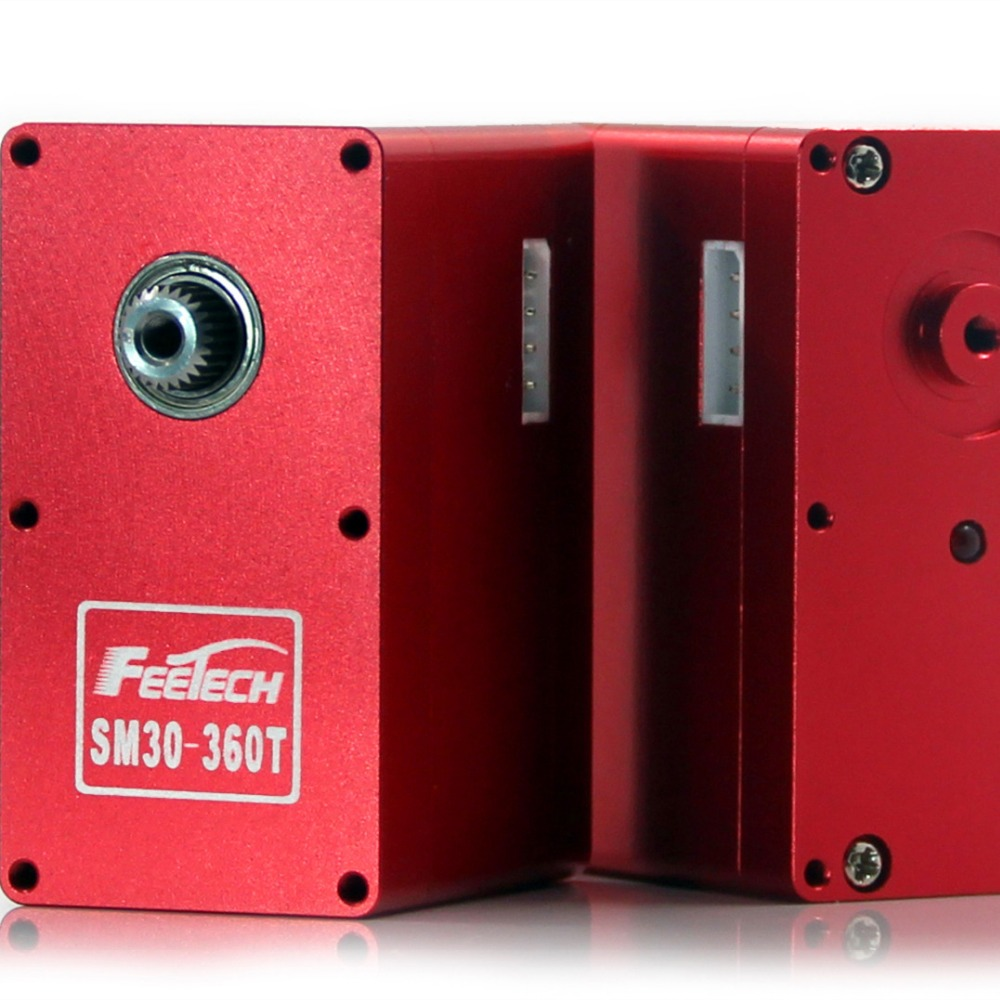

### Requirements

* `` --
* `` --
* `` --
* `` --
* `` --
* `` --
* `` --

### Description

Source: https://www.alibaba.com/product-detail/FEETECH-SM30-360T-M-Serial-bus_60638962033.html?spm=a2700.7724838.2017115.1.6a888b05gjSW7X

#### Quick Details

    Style:              Radio Control Toy
    Power:              Battery
    Scale:              1:5
    Place of Origin:    Guangdong, China (Mainland)
    Model Number:       SM30
    metal gears:        for robot wheel
    type:               metal gears servo
    use:                Small humanoid robot
    rotation range:     0-360
    control system:     digital
    Type:               Car
    Material:           METAL
    Radio Control S...: RC Model
    Brand Name:         feetech
    large 30kg:         robot
    Bearring:           2BB
    color:              red
    fit:                Track drive
    Certificate:        ROHS

#### Package & Delivery

    Packaging Details: -Servo*1PCS
                       -Servo arm*1 bag
                       -GW:199g
    Delivery Time:     Shipped in 5 days after payment

#### Product Description

**FEETECH SM30  Robot  servos for more than 30 kg in 180-360 degree**

SM30-360T/M  Serial bus smart control servo fully integrated Motor, servo
drive,

Serial bus communication interface and sensor together as one servo,Mainly used
for micro robot joint, wheel, track drive,

Can also be used for other simple position control occasions.

Feature:

Big Torque:30Kg. cm

Large Angle:+-30 thousand turns(Arbitrary absolute relative)

DC 6.5V~13V power supply

0.088 degrees Position resolution

Dual output shaftfit for robot joint

High precision all metal gear set,Double ball bearing

Full Aluminium alloyCNC case,Good cooling effect

Position servo control mode ,rotation range 0-360 degrees and many turns
Arbitrary absolute relative angle.

In the speed control mode ,can be continuous rotation,adjust speed

Duplex asynchronous T T L  / 4 8 5  Communication level

Daisy chain connection, 254 ID can choose

High reach  1M  Baud  rate

333Hz servo update rate

Can give feedback on  position,temperature,voltage,speed and  current load

Use open  FT SCS Serial asynchronous communication protocol

SM30-360T/M robot servo adopts advanced servo control technology and 32 bit
high speed ARM microprocessor, fast response, accurate positioning without
jitter. Compared to the traditional RC servo 50Hz control frequency, the
SM30-360T/M series robot servo through the control frequency of up to 333Hz, to
ensure the accuracy of position control and maintain the stability of the
moment.

The SM30-360T/M robot servo uses 12 bits high precision magnetic encoder to
measure the position, the servo output shaft may rotate continuously for a
whole week, the movement torque output is as high as 30kgf.cm.

SM30-360T/M has serial bus interface, the 254 robot servo can form a chain
through the bus. Each servo can be set with different node addresses, multiple
servo wheels can be unified motion can also be a single independent control.

The communication instruction set of SM30-360T/M is completely open, and the
servo communicates with the host computer through the asynchronous serial
interface. The SM30-360T/M can be set to either the motor mode or the position
control mode by sending commands through the asynchronous serial interface.

In motor mode, SM30-360T/M can be used as DC motor, speed adjustable; in
position control mode, 0-360 degrees and multi circle arbitrary absolute and
relative angle can be controlled within this range with accurate position
control performance, speed control.

SM30-360T/M robot servo and the founder of the multi - directional
installation, user-friendly flexible model.

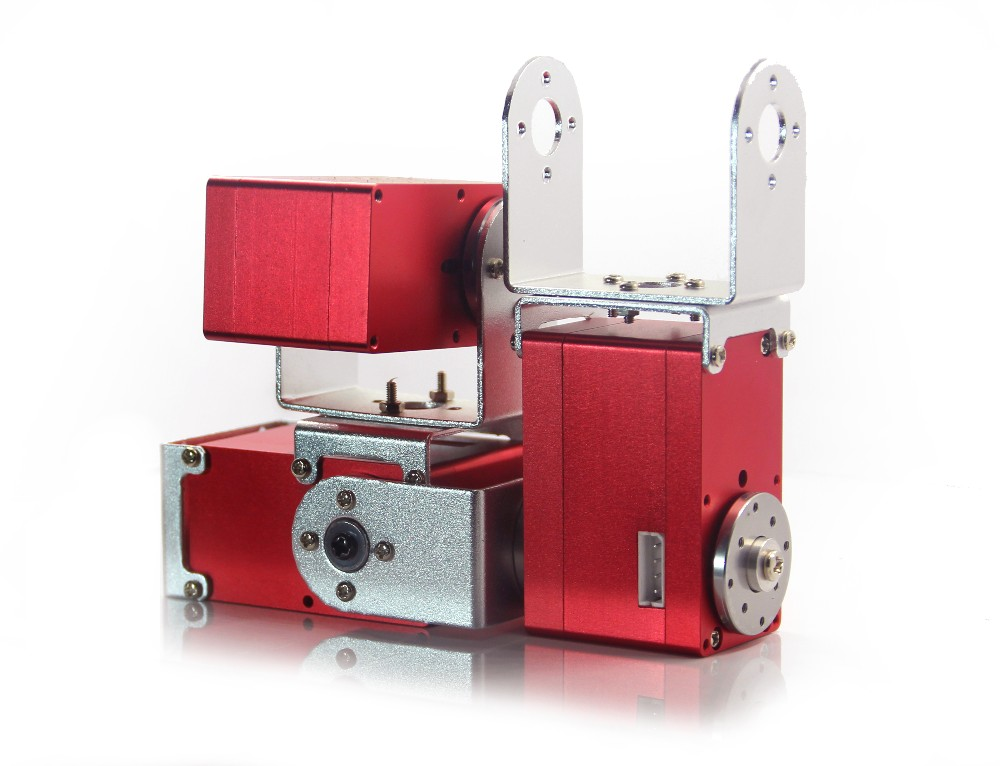

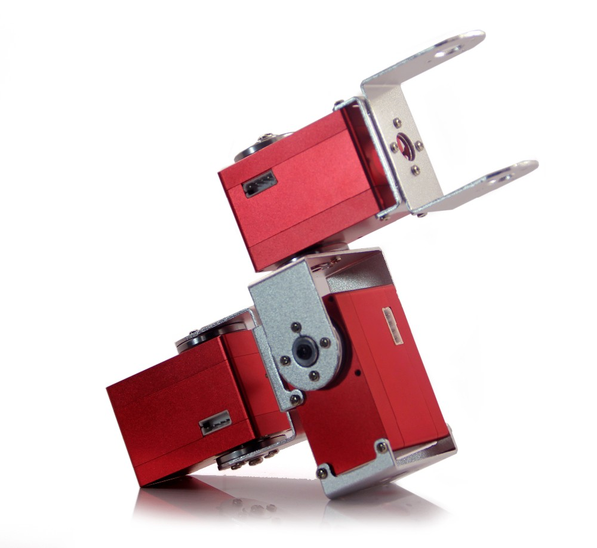

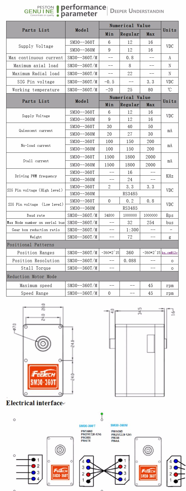

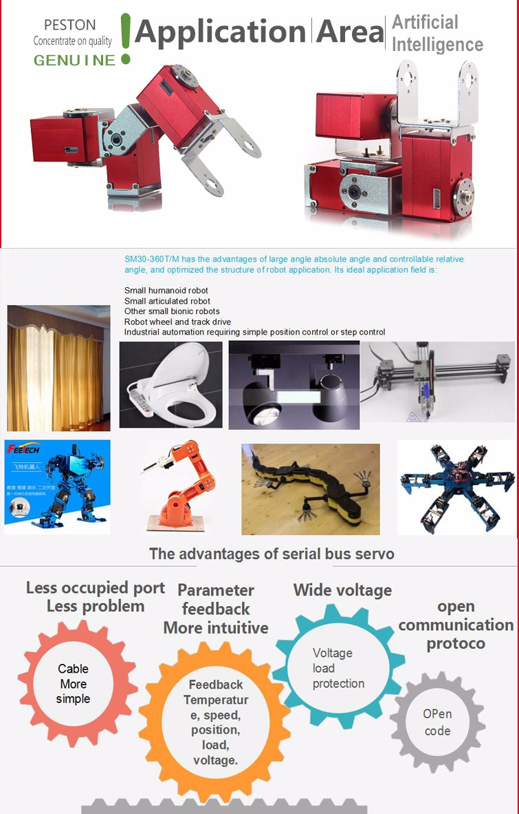

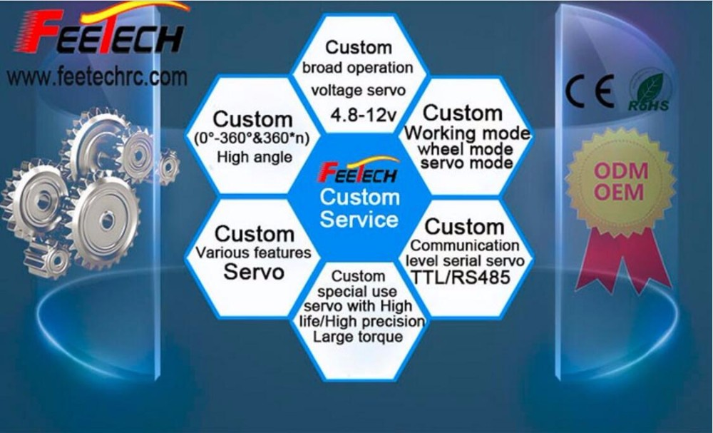

### Risks and Solutions

* ** --
  *Solution:*
* ** --
  *Solution:*
* ** --
  *Solution:*
* ** --
  *Solution:*
* ** --
  *Solution:*
* ** --
  *Solution:*
* ** --
  *Solution:*

\newpage

## `[09]` PWM Motor MG995

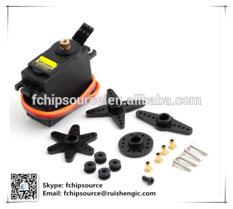

### Requirements

* `` --
* `` --
* `` --
* `` --
* `` --
* `` --
* `` --

### Description

Source: https://www.alibaba.com/product-detail/Original-Servo-MG996R-MG946R-MG995-MG945_60569740899.html?spm=a2700.7724838.2017115.39.6c5b56f3YtRiUs

#### Quick Details

    D/C:             2016+
    Model Number:    MG996R MG946R MG995 MG...
    Brand Name:      Original Brand
    Shipping by:     DHL\UPS\Fedex\EMS\HK Post...
    Weight:          55g
    Package:         Servo
    Type:            Servo
    Place of Origin: Guangdong, China (Mainland)
    Size:            40.7*19.7*42.9mm
    voltage:         4.8V-7.2V

#### Package & Delivery

    Packaging Details: / Cartoon
    Delivery Time:     1-2 days

#### Product Description

**Servo MG996R MG946R MG995 MG945 55g**

**Metal standard steering gear**

Size: 40.8 * 20 * 38 mm

Weight: 55 g

Speed: 4.8 v 0.19sec / 60 degrees

6.0 v 0.18sec / 60 degrees

Torque: 4.8 V  9 kg - cm

V  11 kg - 6.0 cm

Voltage: 4.8 V to 4.8 V

No-load current work: 120 ma

Locked-rotor working current: 1450 ma

The response time of pulse width: 5 or less usec

Error in angular deviation: back to 0 degrees, 45 degrees around each 3 degrees
or less error.There are 90-360 degrees

Gear: 5 metal gears

Cable length: 300 mm

Interface specifications: JR/FP gm.

There are three lines define the steering gear:

Dark grey: GND

Red: 4.8 7.2 V to VCC

The orange line: pulse input

### Risks and Solutions

* ** --
  *Solution:*
* ** --
  *Solution:*
* ** --
  *Solution:*
* ** --
  *Solution:*
* ** --
  *Solution:*
* ** --
  *Solution:*
* ** --
  *Solution:*

\newpage

## `[10]` PWM Motor FS6535

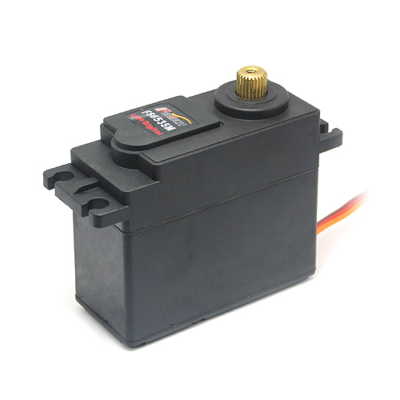

### Requirements

* `` --
* `` --
* `` --
* `` --
* `` --
* `` --
* `` --

### Description

Source: https://www.alibaba.com/product-detail/Feetech-FITEC-FS6535M-30kg-High-Torque_60200752064.html?spm=a2700.7724838.2017115.94.330e9334MVCmgi

#### Quick Details

    Style:                    Radio Control Toy
    Power:                    Battery
    Plastic Type:             ABS
    Radio Control S...:       RC Hobby
    Brand Name:               Feetech
    Control system:           Digital
    Mesurements:              65.8x30.4x57.6
    Bearing Type:             2BB
    Color:                    Black
    Gear Type:                Metal gear
    Type:                     Car, 30kg high torque servo
    Material:                 Plastic
    Scale:                    1:5
    Place of Origin:          Guangdong, China (Mainland)
    Model Number:             FS6535M
    Motor Type:               carbon
    Weight:                   199g
    Stall Torque:             27.5kg.cm/33kg.c(4.8v/6v)
    Connector Leng...:        30cm

#### Package & Delivery

    Packaging Details: 30kg high torque servo / gift packing in export cartons
    Delivery Time:     1 to 3 days

#### Product Description

**Feetech/FITEC FS6535M 30kg High Torque Digital Servo**

|Feetech |Meas.         |Weight|      |Speed    |Stall Torque|             |Operating|
|:------:|:------------:|:----:|:----:|:-------:|:----------:|:-----------:|:-------:|
|        |LxWxH         |      |      |         |            |             |         |
|Item No.|(mm)          |g     |oz    |sec/60   |kg.cm       |oz.in        |Voltage  |
| ------ | ------------ | ---- | ---- | ------- | ---------- | ----------- | ------- |
|FS6535M |65.8x30.4x57.6|199   |7.03  |0.3(4.8v)|27(4.8V)    |382.57 (4.8V)|4.8~6.0V |
|        |              |      |      |0.27(6v) |33(6V)      |459.09 (6V)  |         |

Direction :CCW

Operating Angle :180degree

Required Pulse :500us-2500us

Bearing Type :2BB

Gear Type :Metal

Motor Type :Carbon

Connector Wire Length :30 cm

<!--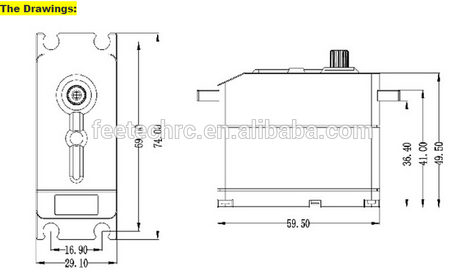-->

<!--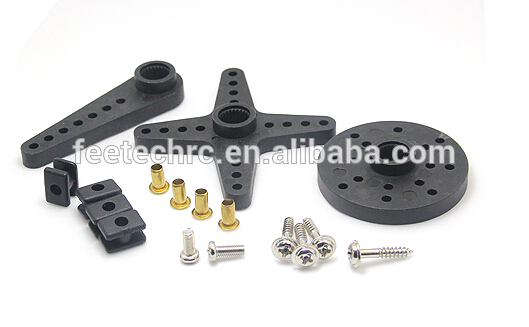-->

<!--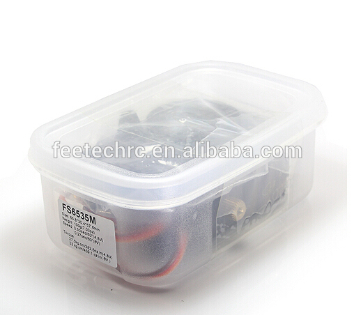-->

### Risks and Solutions

* ** --
  *Solution:*
* ** --
  *Solution:*
* ** --
  *Solution:*
* ** --
  *Solution:*
* ** --
  *Solution:*
* ** --
  *Solution:*
* ** --
  *Solution:*
