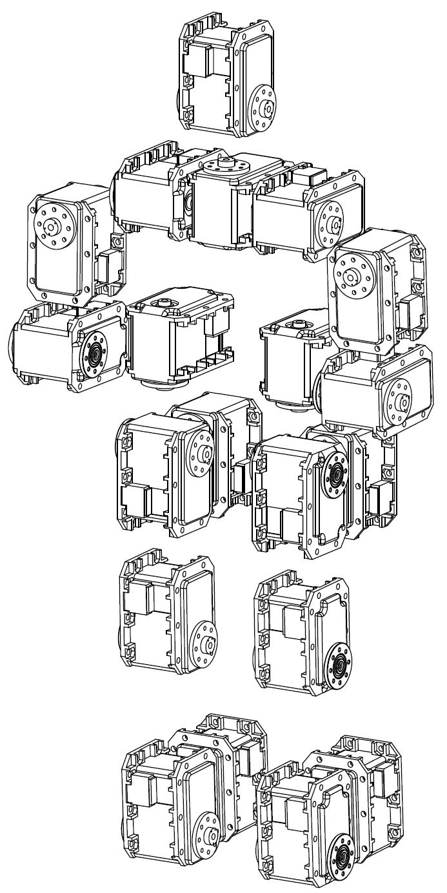

\newpage

# Introduction

This document is to document design decisions for the chassis, particularly
concerning itself with the relationship between limbs and the motor
connections. For this document we aim to predict issues and potentially reduce
workload by finding symmetry.

\newpage

# Diagram

The first diagram shows the positioning of the motors in the DarwinOp assembly
manual. Here we can see the 20 motors in their positions and rotations, along
with the horn attachments for each.

In the second diagram we see our similar recreation, showing labelled motors
and limbs which we will discuss in the *Breakdown* section.

The parts are known as follows (modelled after humans):

* `[P0]` -- Head
* `[P1]` -- Torso
* `[P2]` -- Left upper arm
* `[P3]` -- Right upper arm
* `[P4]` -- Left lower arm
* `[P5]` -- Right lower arm
* `[P6]` -- Left thigh
* `[P7]` -- Right thigh
* `[P8]` -- Left shin
* `[P9]` -- Right shin
* `[P10]` -- Left foot
* `[P11]` -- Right foot

\newpage

# Breakdown

Parts with left and right symmetry have been grouped, with the additional
grouping as follows:

* `[P6]`, `[P7]`, `[P8]` and `[P9]` are essentially the same with identical
connecting parts each side.
* `[P4]` and `[P5]` are the same as `[P6]`, `[P7]`, `[P8]` and `[P9]`, but with
no end connector.

Essentially this means that we have a total of 4 unique parts.

## `[P0]` Head

**TODO:** Write this section.

## `[P1]` Torso

**TODO:** Write this section.

## `[P2]` Left Upper Arm & `[P3]` Right Upper Arm

**TODO:** Write this section.

## `[P4]` Left Lower Arm & `[P5]` Right Lower Arm

**TODO:** Write this section.

## `[P6]` Left Thigh & `[P7]` Right Thigh

**TODO:** Write this section.

## `[P8]` Left Shin & `[P9]` Right Shin

**TODO:** Write this section.

## `[P10]` Left Foot & `[P11]` Right Foot

**TODO:** Write this section.
